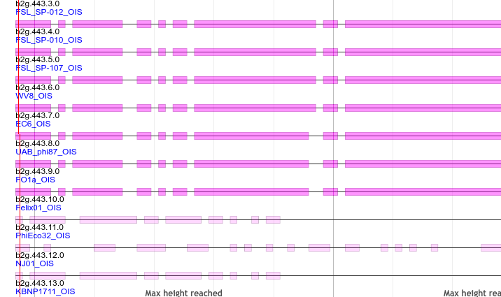
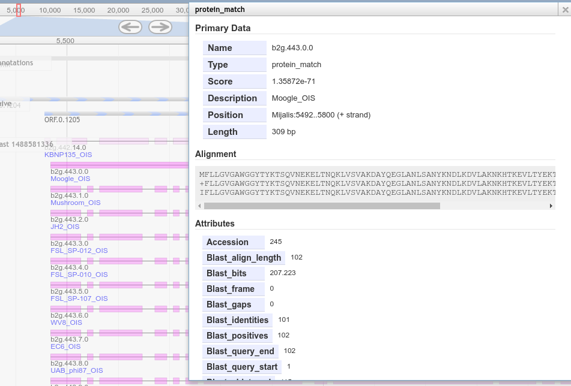

# Blast View Class

Small JBrowse class for viewing blast alignments. This plugin makes MANY
assumptions about the format of your data, and may not work without those assumptions:

- you use `protein_match` / `match_part`
- your features have a `Blast_qseq`, `Blast_mseq`, and `Blast_sseq` attribute in their GFF3 representation

Features like this can be generated using the CPT's tools:

- https://github.com/TAMU-CPT/galaxy-tools/blob/master/tools/blast/blastxml_to_gapped_gff3.py

## Example configuration

```json
{
   "compress" : 0,
   "glyph" : "JBrowse/View/FeatureGlyph/Segments",
   "key" : "Blast 1488583935",
   "label" : "1488583935",
   "storeClass" : "JBrowse/Store/SeqFeature/NCList",
   "trackType" : "BlastView/View/Track/CanvasFeatures",
   "type" : "BlastView/View/Track/CanvasFeatures",
   "urlTemplate" : "tracks/1488583935/{refseq}/trackData.json",
   "style" : {
      "color": "#ff00ff",
      "className" : "feature"
   }
}
```

Please note, if you change the color it MUST be a hexidecimal color.

## Showcase



Nice alignment showing display page:



## License

AGPL-3.0

## Support

This material is based upon work supported by the National Science Foundation under Grant Number (Award 1565146)
